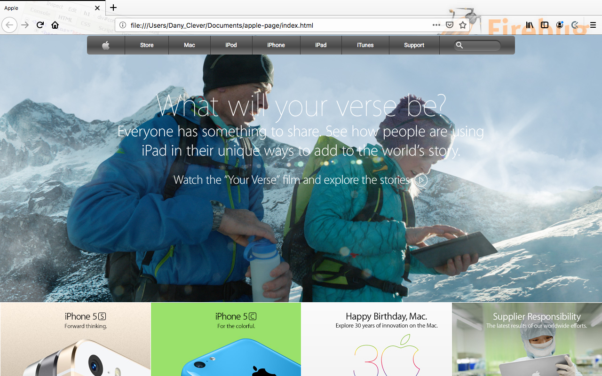

# BUILDING WITH BACKGROUNDS AND GRADIENTS

## Microverse 4th project

## Apple-page old version

In this project i cloned the website of one of the most design-forward companies in the world. It uses background photos well and the navbar at the top contains a gradient that i tried be able to mimic.

Used:
 * HTML5
 * Grid CSS
 
## Author

 * Neto Daniel Zinga https://github.com/dannyclever

## Screenshot

## The Website

Follow the link to acess to the Website: https://github.com/dannyclever/apple-page
